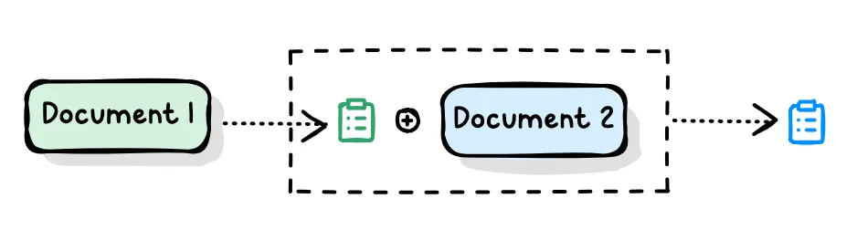
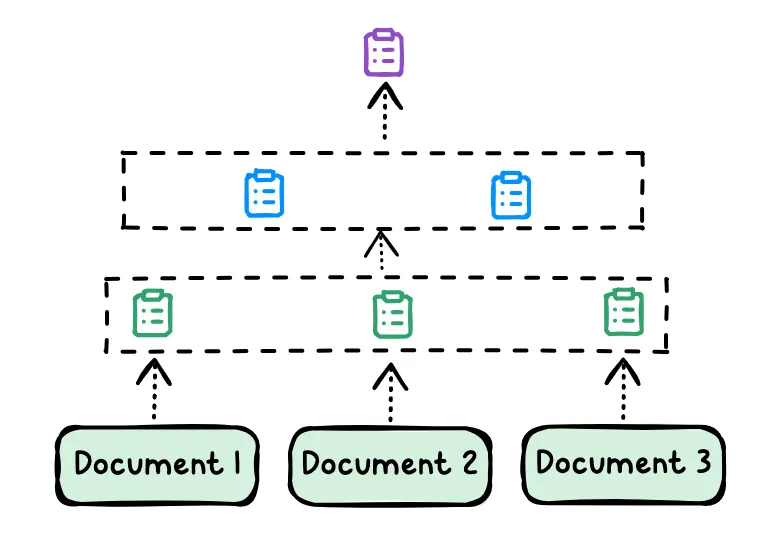

## 概述

RAG 作为知识检索与总结的基础模块，在 Agent 的控制下可以完成更为复杂的推理任务。如果把用 LLM/AI 解决问题看作 Agent。那经典 RAG（知识获取能力） 可以作为 Agent（任务管理和控制能力） 框架下的一个模块，Agent 负责控制多个小模块的运作。

当一个 query 到来时，首先判断这个 query 的类型。根据类型的不同，可以为每个类型打造独立的处理流程。每个模块的组合可以根据任务需求动态调整，这就提供了更多的灵活性。例如，对于信息检索，搜索模块会先从知识库中提取相关信息，再将这些信息交给总结模块。而在多步骤任务中，Agent 可以根据上一阶段的输出来选择下一步操作，例如再次回溯或调整当前任务的策略。这种能力使得agentic rag非常适合解决复杂、跨领域的任务。

除了 RAG 模块，Agent 还可以结合其他工具，例如计算模块、数据库查询模块等。例如，在统计任务中，Agent 可以在语义搜索之后，调用数据库模块来统计结果，最终结合不同数据源给出一个全面的答案。

## 经典 RAG 难以处理的 case

#### case1：summarization

**Iteration - 循环迭代式**

给定一个文档，先对这个文档做一个总结，然后将总结之后的信息抽取出来，再结合第二个文档继续总结，循环到最后一个文档，最后得到完整的总结。

**hierarchy - 树形结构分层总结**

比如先对每个文档做一个总结，然后再不断进行更高层面的总结。

#### case2：comparison

可以分解查询，然后对每个对象进行独立的分析和对比，最后整合结果。

> 例如：在电商平台上，用户想比较产品A、B、C，并希望得到一个总结。经典的rag无法直接给出合理的答案。一个经典的方法是将这个query分解成三个不同的查询，首先理解A、B、C是什么以及它们的详细信息，再进行相应的总结。
{: .block-tip }

#### case3: 语义搜索结合统计

> 比如，“现阶段市场上最活跃的大模型公司中有多少是上市公司？” 首先需要通过语义搜索找到活跃公司名单，然后再从中统计上市公司数目。这需要多步分析，第一步进行搜索，第二步进行统计。
{: .block-tip }

#### case4: 复杂的问题

对于这些复杂的问题，用经典的rag一次性给出回复是困难的。需要将复杂任务拆分成多个步骤，通过agent 控制模块间的运作。

> 例如，需要分析文章主题，再从网上搜索相关内容整理成表格形态，然后进行总结和提出想法。这样的query包含多个任务，需要拆解成不同阶段来处理。
{: .block-tip }

