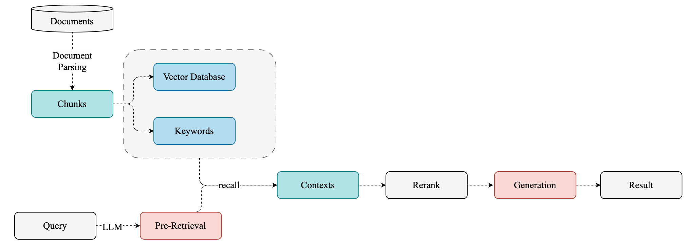
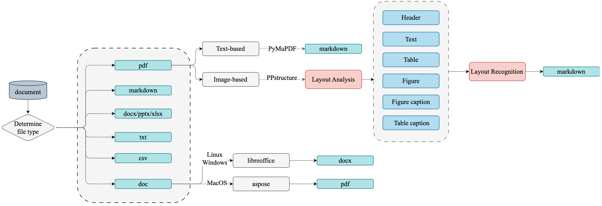
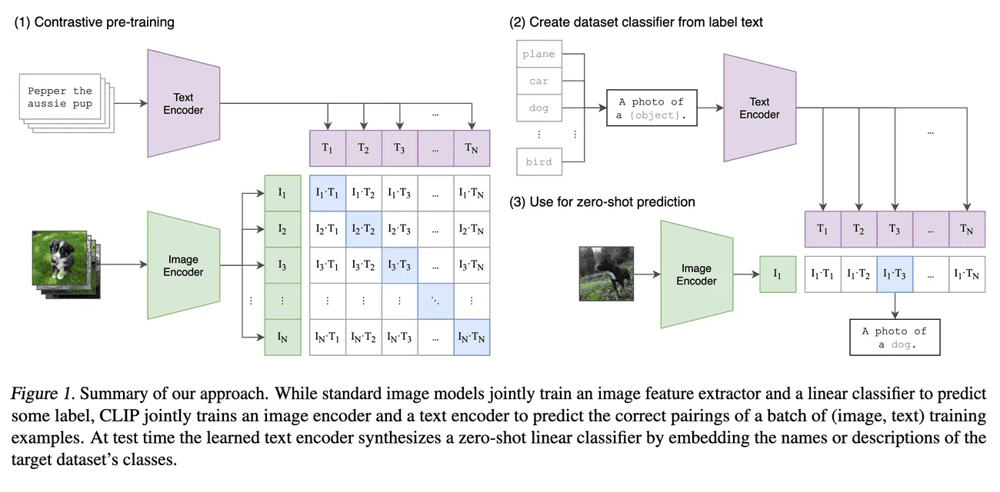
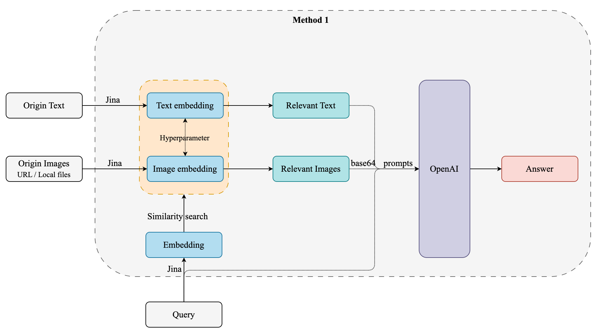
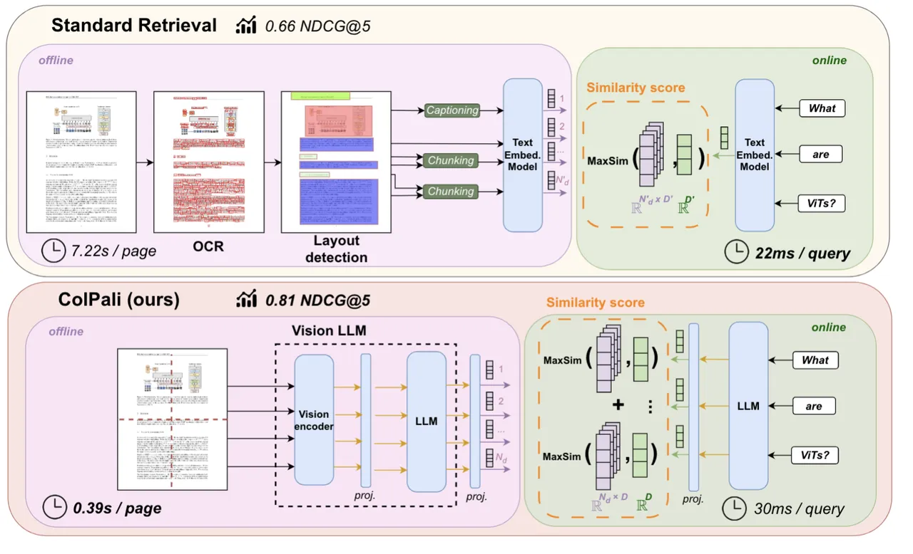
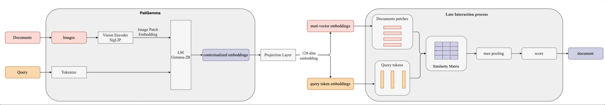
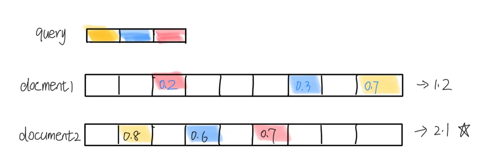
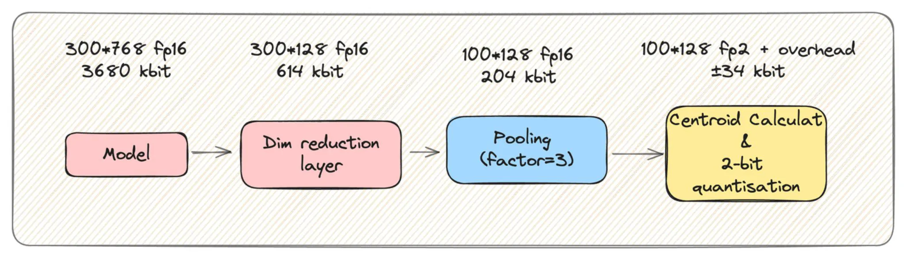

## 概述

本文主要探讨多模态文档检索的方案。对传统 RAG，CLIP，Colpali 三种方案依次介绍。

RAG 基本流程基本：

首先就是要进行文档解析及存储，为了避免 garbage in garbage out，这一步对于后面的生成至关重要。

首先看下一般情况下是怎么对文档进行处理的。

## 传统 RAG

传统 RAG 中对文档解析是一件很麻烦的事，涉及多种文档以及解析策略。

主要面临的挑战如下：

1. 处理 PDF 文档数据特别复杂
2. 需要 OCR 和 layout detection（需要花时间去修正OCR 识别后的布局信息，OCR 有些有些布局识别错误）
3. 处理表格和图形等视觉元素的困难。（比如文本高亮；图形倒是可以通过 jina clip 做 embedding）
4. 太慢了...

通常这种方式主要涉及四阶段的处理流程: 

1. 文档预处理: 针对不同格式的文件做不同的处理
2. 文档内容解析: 包括布局分析、公式检测、OCR、公式识别和表格识别等步骤
3. 文档内容后处理（layout recognition）: 移除无效区域 - 根据区域定位信息拼接内容 - 获取不同文档区域的定位、内容和排序信息
4. 格式转换: 生成所需的各种格式 (如 Markdown)

既然文件中的图片可以用多模态 embedding，那可以试试直接将文档页面转为 Image 做 embedding。

## CLIP

Contrastive Language–Image Pretraining，能够同时理解图像和文本，并在两者之间建立联系，实现了图像和文本之间的跨模态理解。

CLIP的基本原理是对比学习，即让模型学习区分正样本（匹配的图像和文本对）和负样本（不匹配的图像和文本对）。

为了实现这一目标，CLIP使用了一个多模态编码器，它由两个子编码器组成：一个用于图像，一个用于文本。

- 图像编码器可以是基于卷积神经网络（CNN）或者视觉变换器（ViT）的模型，
- 文本编码器则是一个基于Transformer的模型。

这两个编码器都可以将输入转换为一个固定长度的向量表示，然后通过计算向量之间的余弦相似度来衡量图像和文本之间的匹配程度。

目前开源的做的最好的是 Jina-clip（到24.09为止）

### Jina-CLIP

**论文链接：**https://arxiv.org/abs/2405.20204

**项目链接**：https://huggingface.co/jinaai/jina-clip-v1

#### 是什么？

Jina-CLIP 结合了 OpenAI 的 CLIP 模型。*jina-clip-v1 model to achieve the state-of-the-art performance on both text-image and text-text retrieval tasks.* 

用于多模态搜索和匹配任务，比如在图像搜索中，用户可以输入文本查询，然后系统会返回与该文本语义上相关的图像。这样的系统对需要处理大量图像和文本数据的应用非常有用，比如电子商务、数字资产管理和社交媒体平台等。

Jina-CLIP 可以用于创建高效的搜索引擎，支持跨模态的检索，帮助开发者快速构建复杂的 AI 应用。Jina AI 提供的工具和框架使得开发者能够更容易地集成和部署这样的模型，从而加速 AI 产品的开发过程。

#### 怎么用？

因为 Jina 对文本和图片同时 embedding，对于召回的文本和图片，相似度分数不在一个维度，需要有一个超参数来平衡文本和图片分数。超参数如何设定，[Jina 自己有提到](https://huggingface.co/jinaai/jina-clip-v1)。

在 RAG（Retrieval-Augmented Generation）系统中，如果检索到的结果是图片，可以通过以下方法将图片信息应用于生成阶段：

1. 图片描述生成（Image Captioning）：
   - 使用图像描述生成模型（如基于深度学习的模型）将检索到的图片转换为文本描述。这样的模型可以通过分析图像的内容生成一段描述性文字。
   - 将生成的文本描述作为上下文输入到文本生成模型中，以帮助生成更相关的响应。
2. **特征提取和嵌入** ：
   - *使用图像编码模型（如 CLIP 或其他卷积神经网络）提取图像的特征向量。*
   - *将这些特征向量与文本特征结合，作为生成模型的输入。这需要生成模型能够接受多模态输入（图像和文本）。*
3. 知识库补充：
   - 将图片中的信息转化为结构化数据（例如，通过对象检测、场景理解等技术），补充到知识库中。
   - 在生成阶段，利用这些结构化信息作为背景知识来丰富生成内容。
4. 对话上下文增强：
   - 在对话系统中，利用图片的文本描述或特征向量来增强对话上下文。
   - 生成模型可以根据这些上下文信息生成更具针对性的回复，特别是在需要描述或讨论图片内容时。
5. 视觉提示（Visual Prompting）：
   - 如果生成模型支持视觉提示，可以直接使用图像或其特征作为提示，指导生成模型输出与图片相关的内容。

这些方法的选择取决于具体应用场景和技术实现的复杂性。在实现过程中，可能需要结合多个技术栈（如计算机视觉、自然语言处理）以及合适的模型架构，以实现最佳效果。

获取到检索的图像后，可采取两种方案：

1. 图片描述生成
2. LLM vision prompting

具体两种方案的 速度、accuracy、cost 需要进行实验。 同时在多轮对话中验证，多轮对话对于同一图片处理多次。

> Jina-CLIP 接受的 image是：URL 或本地图片，不接受 base64。因为内置的 encode_image 就是将 图像转为 base64.
>
> openai 接受：网络 URL 和 base64.
{: .block-tip }

但是，文档中往往涉及很多不同的类型的数据，直接转为一张 Image 用 Jina clip 做 embedding 来是能力欠缺。这种方式表现出信息损失：要么文本信息丢失，要么表格被误解，要么格式的重要性丢失。

## ColPali 多模态文档检索模型

ColPali 通过直接处理文档图像来解决这些问题，消除了复杂预处理的步骤，实现更快、更准确的检索。

> https://github.com/illuin-tech/colpali
>
> https://huggingface.co/vidore/colpali

#### 是什么/Architecture？

利用 VLMs （`PaliGemma`）的文档理解能力，仅通过将文档页面转为图像生成高质量上下文 embedding。结合（[`ColBERT`](https://www.notion.so/ColBERT-Contextualized-Late-Interaction-BERT-1050718c9ab080319afbe98b9f21b760?pvs=21)） late interaction 匹配机制，ColPali 大幅超越现代文档检索流程，同时速度更快且可端到端训练。(下面会有ColBERT 的介绍)

> It is a [**PaliGemma-3B**](https://huggingface.co/google/paligemma-3b-mix-448) extension that generates [**ColBERT**](https://arxiv.org/abs/2004.12832)- style multi-vector representations of text and images.
>
> PaliGemma 通过将图像分割成固定大小的块（patches），然后对这些块进行编码以生成图像特征表示。设计目标之一是确保图像和文本之间的多模态对齐，从而在同一向量空间中表达这些不同类型的数据。

ColPali 的核心是基于 PaliGemma-3B 模型，该模型结合了：

1. A [**SigLIP-So400m/14 vision encoder**](https://huggingface.co/google/siglip-so400m-patch14-384)
2. A [**Gemma-2B**](https://unfoldai.com/gemma-2b/) language model

ColPali 架构通过添加以下内容扩展了 PaliGemma：

- 一个投影层将语言模型嵌入映射到低维空间（D=128）
- 一种受 [ColBERT](https://www.notion.so/ColBERT-Contextualized-Late-Interaction-BERT-1050718c9ab080319afbe98b9f21b760?pvs=21) 检索模型启发的 late interaction 机制

#### 工作原理

**离线索引阶段**

1. 每个文档页面都通过视觉编码器 （SigLIP） 送入
2. 生成的图像补丁嵌入由语言模型 （Gemma-2B） 处理
3. 投影层将输出映射到低维空间
4. 生成的嵌入内容将存储为文档页面的多向量表示形式

**在线查询阶段**

1. 使用 LM 对 query 做 embedding
2. 后期交互机制计算 **query tokens** 和  **document patches** 之间的相似性分数
3. 系统根据这些分数返回最相关的文档

**特点**

1. 仅使用视觉特征的高效文档索引
2. 在文档检索任务有最好性能
3. 处理各种文档类型的能力，包括文本、表格和图形
4. 端到端可训练架构
5. 查询阶段的低延迟

**Advantages:**

1. **Speed**: ColPali 的索引过程比传统方法快得多，因为它绕过了复杂的预处理步骤。
2. **Accuracy**: 通过利用视觉特征，ColPali 在文档检索中实现了更高的准确性，特别是对于视觉丰富的文档。
3. **Flexibility**: ColPali 可以处理各种文档类型和语言，无需修改。
4. **Efficiency**: The late interaction mechanism allows for fast querying even with large document corpora.
5. **Interpretability**: ColPali 提供了可视化，显示哪些图像块对检索决策贡献最大，从而增强了可解释性。

**Benchmark**

https://github.com/illuin-tech/vidore-benchmark

https://medium.com/@simeon.emanuilov/colpali-revolutionizing-multimodal-document-retrieval-324eab1cf480

#### 应用

[byaldi](https://github.com/AnswerDotAI/byaldi) 一个封装了 colpali 接口的库。

Byaldi索引默认是存储在文件中的，如果要存储到数据库中，就不能用了。

### ColBert| Contextualized Late Interaction BERT

#### WHY：**传统向量搜索**：

- 但将信息从数百个 token 压缩到单个向量必然会丢失信息。
- 传统的向量搜索依赖于将查询和文档表示为固定维度的向量，并通过计算相似度来匹配。这种方法缺乏对具体词汇的直接解释，因为用户只能看到相似度分数，而不能追踪到哪些具体的词或特征影响了这个分数。
- 向量生成通常是通过复杂的嵌入模型，这些模型的内部机制对用户来说是“黑箱”的，难以理解。

#### WHAT：

ColBERT是对 BERT 的一种改进，特别是在信息检索和问答系统等任务中。multi-vector representations of text and images

ColBERT的主要特点是：

1. **保留 Token-wise Representation**： 将 query 和 document tokenize，然后对 token embedding

2. **延迟交互** ：ColBERT引入了一种“延迟交互”的机制，在检索过程中，先计算每个query 的 token 表示，然后计算 query tokens 和 document tokens 之间的相似性得分。将所有这些 token 级别的最大得分相加，生成整体的 MaxSim 相关性得分，从而找出最相关的文档。

   

   MaxSim: 每一个 query token 都与 document 中 token 计算得分，获取得分最高的 token。

   > 虽然 late interaction 方法相对于简单的整合向量计算有更高的计算复杂度，但其线性复杂度
   >
   > O(m×n) 使得实际应用依然是可行的，并带来了更好的效果。
   >
   {: .block-tip }

> 对于一个给定的 512 个 toekn 的文档，我们似乎存储了512倍的数据?
>
> - 第一个是之前提到的降维层。
> - 第二个是激进的量化：ColBERT向量可以压缩到2位，并保持超过99%的性能！
> - 最近的研究表明，还可以进行小规模的池化，以进一步减少50%到75%的存储，同时几乎没有性能损失。
>
> 
