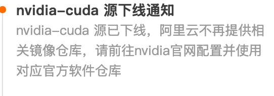

# 1. 使用 VLLM 部署 glm4
vllm 需要合适的 cuda toolkit 版本才能运行。cuda 12.1 或者 cuda 11.8

目前环境：NVIDIA-SMI 510.108.03   Driver Version: 510.108.03   CUDA Version: 11.6

经过各种尝试，在 `cuda 11.6` 下运行不了。

https://github.com/vllm-project/vllm/issues/1907

所以需要使用 `cuda 11.8` 来运行 vllm。（要用 `cuda12.1` 需要更新服务器上 Driver 版本，需要管理员权限 + 可能影响别的现有服务。）

由于所使用的 huawei server 没有配置代理服务器，所以无法使用官方的镜像源。而国内的镜像源[拉不到  nvidia/cuda 的镜像了](https://developer.aliyun.com/mirror/)。（`nvidia/cuda:11.8.0-cudnn8-runtime-ubuntu20.04`）。



目前只找到一个 `cuda12.1` 的可用镜像：[egs-registry.cn-hangzhou.cr.aliyuncs.com/egs/vllm:0.4.0.post1-pytorch2.1.2-cuda12.1.1-cudnn8-ubuntu22.04](http://egs-registry.cn-hangzhou.cr.aliyuncs.com/egs/vllm:0.4.0.post1-pytorch2.1.2-cuda12.1.1-cudnn8-ubuntu22.04)

没找到 `cuda11.8` 的，所以无法使用 docker 部署服务。

## 安装 cuda11.8

1. 在(当前用户)主目录下创建一个用于安装 CUDA 的目录：

```bash
mkdir -p $HOME/cuda-11.8
```

2. 下载 CUDA 11.8 运行文件

前往 [NVIDIA CUDA Toolkit 存档页面](https://developer.nvidia.com/cuda-toolkit-archive)。选择 **CUDA Toolkit 11.8**，然后选择适用于操作系统的 **运行文件（runfile）** 安装程序。使用 `wget` 命令下载运行文件到主目录：

3. 为运行文件添加可执行权限

```python
chmod +x cuda_11.8.0_520.61.05_linux.run
```

4. 运行安装程序

```python
sh cuda_11.8.0_520.61.05_linux.run --silent --toolkit --toolkitpath=$HOME/cuda-11.8 --override
```

5. 配置环境变量

```python
vim ~/.bashrc

export PATH=$HOME/cuda-11.8/bin:$PATH
export LD_LIBRARY_PATH=$HOME/cuda-11.8/lib64:$LD_LIBRARY_PATH

source ~/.bashrc
```

6. 验证

```python
nvcc -V
```

## 安装 vllm

[Installation — vLLM](https://docs.vllm.ai/en/latest/getting_started/installation.html)

新建个 conda 环境。`pip install vllm`  默认会安装 cuda-12.1。所以使用

```bash
# Install vLLM with CUDA 11.8.
export VLLM_VERSION=0.6.1.post1
export PYTHON_VERSION=310
pip install <https://github.com/vllm-project/vllm/releases/download/v${VLLM_VERSION}/vllm-${VLLM_VERSION}+cu118-cp${PYTHON_VERSION}-cp${PYTHON_VERSION}-manylinux1_x86_64.whl> --extra-index-url <https://download.pytorch.org/whl/cu118>
```

实际中，这个过程非常慢（显示需要 3 个半小时）。所以在本地下载 `.whl` 文件复制到云上。

```bash
# 本地：
curl -L -o vllm-0.6.1+cu118-cp310-cp310-manylinux1_x86_64.whl <https://github.com/vllm-project/vllm/releases/download/v0.6.1.post1/vllm-0.6.1.post1+cu118-cp310-cp310-manylinux1_x86_64.whl>

# 上传
scp -i <*/Users/liangzhu/Documents/intern/shuyuan/dev/pillar_rsa>* vllm-0.6.1+cu118-cp310-cp310-manylinux1_x86_64.whl pillar@122.9.148.246:*</home/pillar/>*

# server 中安装
pip install /home/pillar/vllm-0.6.1+cu118-cp310-cp310-manylinux1_x86_64.whl --extra-index-url <https://download.pytorch.org/whl/cu118>
```

## 部署 glm

先下载 glm-4-9b 模型，下载后的模型在：`/home/pillar/glm-model/GLM-4` 目录中。

```bash
pip install modelscope -i <https://pypi.tuna.tsinghua.edu.cn/simple>

modelscope download --model ZhipuAI/glm-4-9b-chat --local_dir /home/pillar/glm-model/GLM-4
```

启动 vllm 服务：

```bash
nohup python -m vllm.entrypoints.openai.api_server \\
  --model /home/pillar/glm-model/GLM-4 \\
  --served-model-name glm-4-9b \\
  --max-model-len=2048 \\
  --trust-remote-code \\
  --dtype=half > server.log 2>&1 &
```

- –host 和 --port 参数指定地址。
- –model 参数指定模型名称。
- –chat-template 参数指定聊天模板。
- –served-model-name 指定服务模型的名称。
- –max-model-len 指定模型的最大长度。

验证：

```bash
# 查看当前的模型列表。
curl <http://localhost:8000/v1/models>
curl -X POST "<http://localhost:8000/v1/chat/completions>"      -H "Content-Type: application/json"      -d '{
           "model": "glm-4-9b",
           "messages": [{"role": "user", "content": "你好，GLM-4！"}],
           "max_tokens": 50,
           "temperature": 0.7
         }'
```
