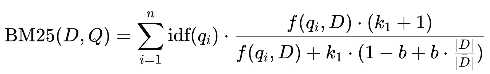
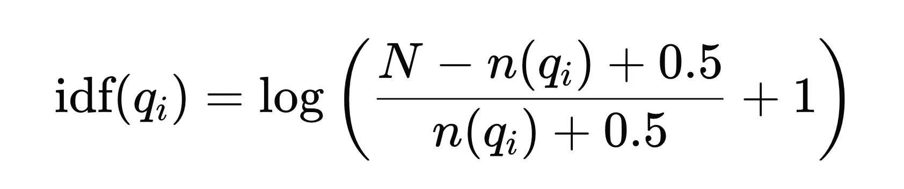
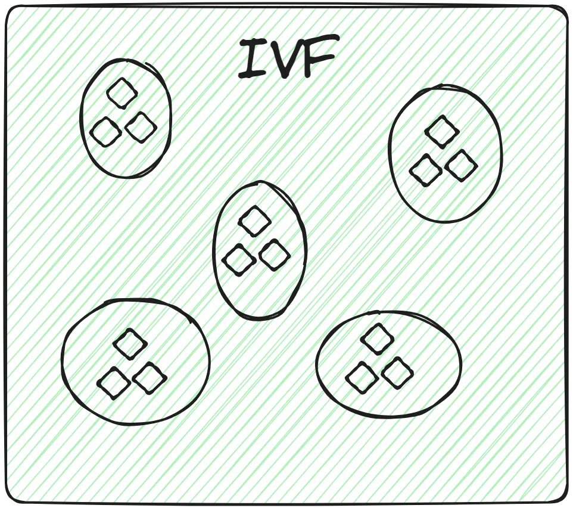
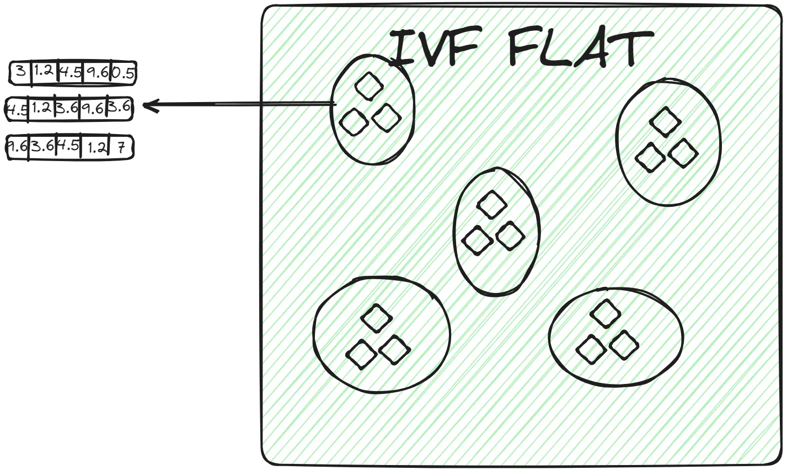
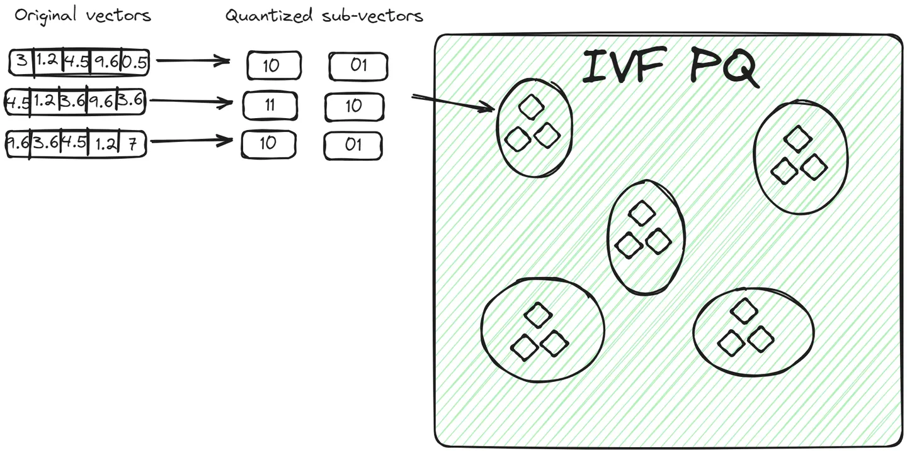
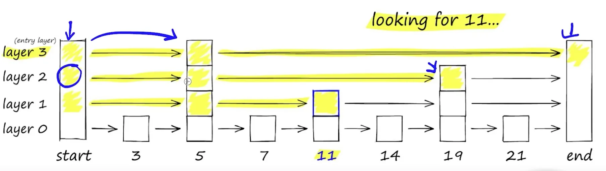
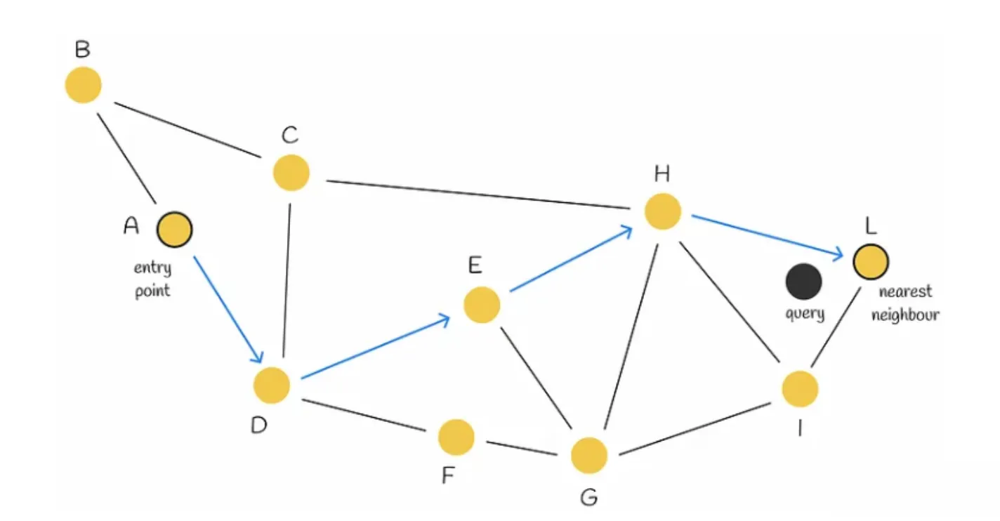
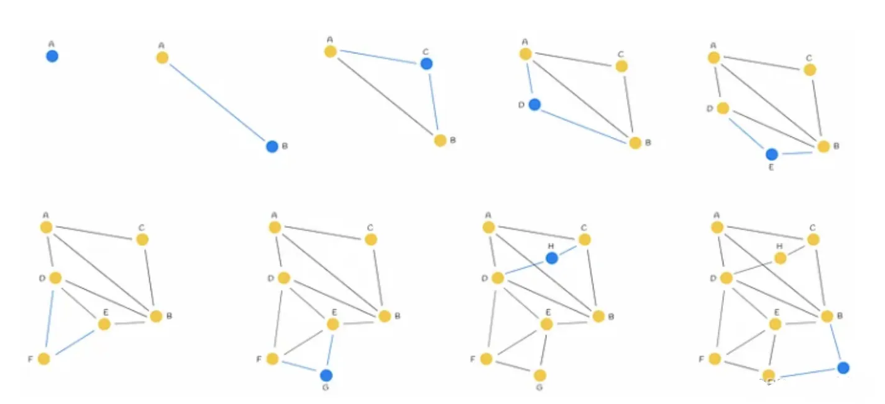
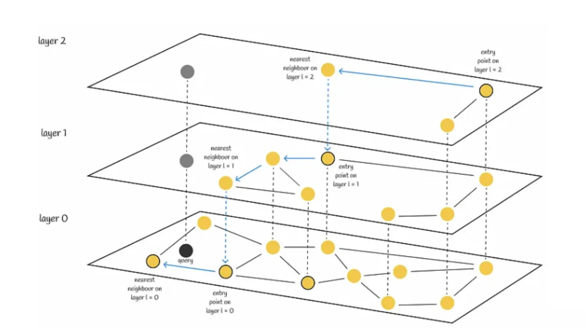
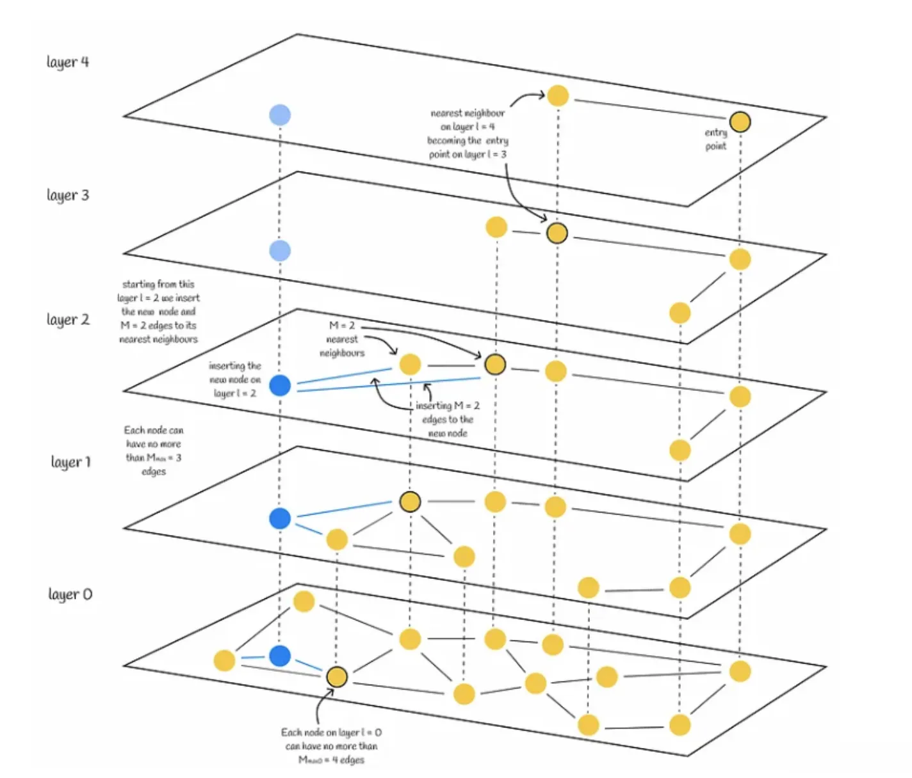

# 0. 召回

召回：快速准确获取相关信息的过程。召回可以被理解为**建立索引**和**相似度得分匹配**的结合。

索引负责缩小查找范围，而相似度得分匹配负责对缩小范围内的项进行精细排序。这样，系统能够在保证速度的同时，尽可能提高结果的相关性。

**建立索引** ：

- **Indexing** 可以视为一种对数据集进行分组的方式。作用是把相似的数据放在一起，在查询时不需要遍历整个数据库，只查看与query 相似的那些数据集合。旨在减少查找时需要扫描的数据量。通过预先组织和存储数据的指针（或引用），索引能够在更小的范围内进行查找，从而显著提高查找速度。例如，B树和哈希表等数据结构都是为了加速查找过程而设计的。
- 索引的核心目的是通过优化数据的组织和访问方式，来加快查找速率。这一过程涉及到数据结构的选择、存储方式的设计以及对查找算法的优化。

**相似度得分匹配** ：
在建立索引之后，系统需要评估每个潜在相关项与查询之间的相关性。这是通过计算相似度得分来实现的。相似度得分用于排序结果，以便返回最相关的项给用户。

# **1. Keyword-based search**

## Indexing - Inverted Index 倒排索引

倒排（Inverted）索引 - 反转传统文档到词的关系。It is about the mapping between words and document lists.

- 在原始数据结构中，一个文档包含多个词。
- Inverted Index 反转了上述关系。它以词（term）为键，项（倒排列表）存储包含该词的文档信息（如文档ID、词频、位置等）。

> 假设有以下三个文档：
>
> - **文档1**：`"the cat sat on the mat"`
> - **文档2**：`"the cat lay on the rug"`
> - **文档3**：`"the dog barked at the cat"`
>
> 首先，对文档进行预处理（分词、去除停用词等），然后构建倒排索引。
>
> | 词项（Term） | 倒排列表（Posting List） |
> | ------------ | ------------------------ |
> | `the`        | 文档1, 文档2, 文档3      |
> | `cat`        | 文档1, 文档2, 文档3      |
> | `sat`        | 文档1                    |
> | `on`         | 文档1, 文档2             |
> | `mat`        | 文档1                    |
> | `lay`        | 文档2                    |
> | `rug`        | 文档2                    |
> | `dog`        | 文档3                    |
> | `barked`     | 文档3                    |
> | `at`         | 文档3                    |
>
{: .block-tip }


## Similarity score - BM25 | Best Matching 25

BM25 ranking 算法通过考虑词项频率、逆文档频率和文档长度归一化，在提高搜索引擎性能方面发挥了重要作用。




对于查询 $Q$，文档 $D$ 的 BM25 分数是各个 $query$ 项分数的总和。

- $D$  : 文档
- $Q$  : 查询
- $q_i$  : 查询中的第  $i$  个词
- $f(q_i, D)$  : 词  $q_i$  在文档  $D$  中的出现频率
- $｜D｜$  : 文档  $D$  的长度（词数）
- $\overline{｜D｜}$  : 文档集合的平均长度
- $k_1$  和  $b$  : 调节参数，通常取值为  $k_1 \approx 1.2$  到  $2.0$  之间， $b$  一般取值为  $0.75$ 。

### **Key Components of BM25**

- **TF - Term Frequency - 词频**
  一个词在一篇文档中出现的次数。一般来说，一个词出现得越多，它的词频就越高。文档与查询的相关性就越高。

- **IDF - Inverse Document Frequency**
  IDF: 衡量一个词的重要性的指标，在整个语料库中出现次数越少分数越高。越具有区分性。

  

  其中：

  - $N$ 是文档总数。
  - $n(q_i)$ 是包含词 *$q_i$* 的文档数量。

  由于IDF是基于整个文档集合的统计信息，因此对于同一个查询中的所有文档，IDF值是相同的。

- **Document Length Normalization | 文档长度归一化**:
  BM25 引入了文档长度归一化的概念，较长的文档可能会包含更多的词，可能会导致评分时偏向于这些长文档。因此需要进行归一化处理，即通过参数 $b$来调整文档长度对评分的影响。以避免长文档在评分时的不公平优势。

- Implementation:

  ```python
  import math
  from collections import Counter
  
  class BM25:
      def __init__(self, documents):
          self.documents = documents
          self.document_count = len(documents)
          self.avg_document_length = sum(len(doc) for doc in documents) / self.document_count
          self.term_counts = self.calculate_term_counts()
          self.k1 = 1.2
          self.b = 0.75
  
      def calculate_term_counts(self):
          term_counts = Counter()
          for document in self.documents:
              term_counts.update(document)
          return term_counts
  
      def calculate_idf(self, term):
          document_with_term_count = self.term_counts[term]
          return math.log((self.document_count - document_with_term_count + 0.5) / (document_with_term_count + 0.5))
  
      def calculate_bm25_score(self, query, document):
          score = 0.0
          document_length = len(document)
          query_terms = Counter(query)
  
          for term in query_terms:
              if term not in self.documents:
                  continue
              idf = self.calculate_idf(term)
              term_frequency = document.count(term)
              numerator = term_frequency * (self.k1 + 1)
              denominator = term_frequency + self.k1 * (1 - self.b + self.b * (document_length / self.avg_document_length))
              score += idf * (numerator / denominator)
  
          return score
  
      def rank_documents(self, query):
          document_scores = []
          for document in self.documents:
              score = self.calculate_bm25_score(query, document)
              document_scores.append((document, score))
          
          ranked_documents = sorted(document_scores, key=lambda x: x[1], reverse=True)
          return ranked_documents
  
  
  # Example usage:
  documents = [
      ['apple', 'banana', 'orange', 'apple'],
      ['banana', 'orange', 'orange'],
      ['apple', 'apple', 'banana', 'banana'],
      ['orange', 'orange', 'banana']
  ]
  
  bm25 = BM25(documents)
  query = ['apple', 'banana']
  ranked_documents = bm25.rank_documents(query)
  
  for document, score in ranked_documents:
      print(f"Document: {document}, Score: {score}")
  ```

  


# **2. vector search**

向量检索的核心思想是将数据（如文本、图像等）转换为高维向量表示，然后通过计算向量之间的相似度来进行检索。

#### **relational database vs vector database**

|                         | relational database                    | vector database                   |
| ----------------------- | -------------------------------------- | --------------------------------- |
| type of data they store | structured data                        | unstructured data: text or images |
| query results           | based on matches for specific keywords | based on similarity               |

关系型数据库的缺点包括：

- 必须事先想好用户可能会搜索什么信息
- 如果用户搜索的关键字没有在数据记录中提及（如书的摘要中未提及“食物”），相关而重要的信息（比如与食物相关的书籍）可能无法被检索到。
- 添加所有可能需要的信息非常耗时，并且仍然无法保证找到的信息是完整的，因为可能无法预测到所有用户查询的需求或关键字。


## **vector database**

They were used in recommendation systems and have also been used in question-answering applications recently.

[理解向量索引](https://myscale.com/blog/zh/everything-about-vector-indexing/)

## **Indexing**

ANN（Approximate Nearest Neighbors） 是构建索引的原则（策略）。

> **KNN vs ANN**
>
> - KNN: 直接计算查询点与所有数据点的距离，通常不使用复杂的索引结构。精确但 **time-consuming(耗时)**
> - ANN: 使用数据结构（如局部敏感哈希、KD树、HNSW等）来组织数据。这些结构旨在减少搜索空间，使得查找过程更快。在查询时，利用索引快速找到与查询点近似的k个最近邻，而不是精确的最近邻。
>
{: .block-tip }

ANN 算法分为 3 类：Trees、Hashes、Graphs

- **查询速度** ：LSH > IVF > HNSW
- **精度** ：HNSW > IVF > LSH
- **数据规模**：LSH ≈ IVF > HNSW

**HNSW - 适合高维数据，提供了快速且精度较高的搜索，但构建索引的开销较大，所以对内存的消耗也大。**

### 1. **Inverted File(IVF) | 倒排文件**

这是最基本的索引技术。它使用 K-means 聚类等技术将整个数据分成多个簇。对于每个聚类中心，建立一个倒排列表，记录属于该簇的所有向量的ID。数据库中的每个向量都分配给特定的簇。

在查询时，首先计算查询向量与各个**聚类中心**的距离，快速确定查询向量最接近的几个簇。然后，仅在这些候选簇的倒排列表中执行更精细的相似度计算，以找到最近邻向量。



#### **IVF的变体：IVFFLAT、IVFPQ和IVFSQ**

**IVFFLAT**

IVFFLAT 是 IVF 的一种基本实现，结合了倒排文件和线性扫描。其过程如下：

- **线性扫描** ：在分配到的簇的倒排列表中，通过线性扫描的方式找到与查询向量最相似的向量。
- IVFFLAT用于数据集不是非常大且搜索过程需要高准确性的场景。由于线性扫描的复杂度，随着簇的规模增大，效率可能会下降。



**IVFPQ ｜ Inverted File with Product [Quantization](https://www.notion.so/Fine-Tune-f19edf0433dc48409842c0ef0e01f893?pvs=21)**

在使用 IVF 构建好簇后，如何在簇内高效检索到其中的相似的向量。

在IVFPQ中，簇中的向量被分解为多个子向量。每个子向量使用产品量化（PQ）进行编码。对于查询向量，当确定相关簇后，查询向量也会被分解为相同的子向量，并使用相同的量化方法进行编码。比较时，计算查询向量的量化子向量与簇内所有向量的量化子向量之间的距离（通常是欧氏距离或其他合适的距离度量）。每个子向量的比较会产生一个距离分数。将所有子向量的距离分数加总或合并，得到最终的完整向量的距离分数。

与 **IVFFLAT** 相比，这种方法有两个优点：

- 向量以紧凑的方式存储，占用的空间比原始向量少。
- 查询过程更快，因为它不比较所有原始向量，而是比较编码向量。



**IVFSQ ｜ Inverted File with Scalar Quantization**

在IVFSQ中，每个簇中的每个向量都经过标量量化处理。

- **标量量化** ：对每个维度进行独立量化，通常使用少量的比特表示每个维度，从而减少存储需求。
- **优点** ：标量量化通常比产品量化更简单，计算开销更小，但可能会导致更大的近似误差。

> 例子：
>
> 假设你有一个数据点 (3.14159, 2.71828, 1.61803)，而你为每个维度选择的码本是：
>
> - 维度 1: [3.0, 3.5, 4.0, 4.5]
> - 维度 2: [2.5, 3.0, 3.5, 4.0]
> - 维度 3: [1.5, 2.0, 2.5, 3.0]
>
> 经过量化，这个数据点可能被映射为 (3.0, 2.5, 1.5)，并且用索引 (0, 0, 0) 来表示。
{: .block-tip }

[**supplement**](https://www.notion.so/supplement-d830c304f23c4e6e899ca9ebca507823?pvs=21)


### 2. Hierarchical Navigable Small World (HNSW)

https://www.pinecone.io/learn/series/faiss/hnsw/

HNSW = probability skip lists + Navigable Small World(NSW) graphs




#### Navigable Small World | NSW

是一个搜索复杂度为多对数 $T = O(log n)$的图，它使用贪婪路由。

**搜索过程：**从低度顶点开始，到高度顶点结束。由于低度顶点的连接很少(zoom out)，算法可以在它们之间快速移动，有效地导航到最近的邻居可能所在的区域。然后，算法逐渐切换到高度顶点（zoom in），在该区域的顶点中寻找最近的邻居。



**NSW图构建**：每个新点都向其K近邻连边，那么早连的边就会成为long range link。




#### **HNSW算法**

HSNW基于与skip list 和 Navigable Small World 相同的原理。它的结构是一个多层图，顶层的连接较少，底层的区域较密集。

1. **Search**

   搜索从最高层开始，每当在各层节点中贪心找到当前最近邻居时，就向下搜索一层。最终，在最底层找到的近邻就是查询的答案。

   我们会寻找与查询向量最近的 efSearch（一个超参数）近邻，并将这些近邻中的每一个作为下一层的切入点。

   

2. **Construction**

- **层级参数（$L$）** ：决定图有多少层。
- **层级乘数（$m_L$）** ：影响向量被分配到各层的概率。
- **连接参数（M, M_max, M_max0）** ：决定每个节点的连接数。
- **搜索参数（ef, efConstruction）** ：影响搜索时的邻居数量

假设我们要插入一个新节点 $q$：

1. 根据概率函数和 $m_L$，被随机分配一个整数 $L$. 表示该节点在图中能出现的最大层数。

2. 节点被赋值层数 $L$ 后，其插入分为两个阶段：

   1. 算法从顶层开始，贪心寻找最近的节点。然后将找到的节点作为下一层的入口点，继续搜索过程。一旦到达第 $l$ 层，插入就进入第二步。(在 $L$ 层之前都不插入)
   2. 从第 $l$ 层开始，算法在当前层插入新节点。然后，该算法与步骤 a 相同，但不再只寻找一个最近的邻居，而是寻找 `efConstruction`（超参数）最近的邻居。然后，从 `efConstruction` 近邻中选出 M 个，并建立从插入节点（新节点）到它们的边。之后，算法进入下一层，每个找到的 efConstruction 节点都是一个入口点。新节点及其边插入最底层 0 后，算法结束。

   

### 3. LSH | Locality-Sensitive Hashing | 局部敏感哈希

旨在通过哈希函数将相似的数据点映射到相同的桶中，从而提高在大规模数据集中查找相似项的效率。


## **Similarity Measures**

一旦通过索引定位到了可能相似的向量集，然后需要量化查询向量与该集合中每个向量之间的相似度。

#### **余弦相似性（Cosine Similarity）**：

度量两个向量在方向上的相似度，常用于文本数据，因为它只考虑向量之间的角度，而不受向量长度的影响。

$$ Cosine Similarity = \frac{\mathbf{A} \cdot \mathbf{B}}{\|\mathbf{A}\| \|\mathbf{B}\|} $$

其中，$\mathbf{A} \cdot \mathbf{B}$ 表示向量 $\mathbf{A}$ 和 $\mathbf{B}$ 的点积，$\|\mathbf{A}\|$ 和 $\|\mathbf{B}\|$ 表示向量的范数（即向量的长度）。

#### **点积（Dot Product）**：

数学上表示两个向量的相似度，可以看作是向量在长度和方向上的综合相似度。

$$ \mathbf{A} \cdot \mathbf{B} = \sum_{i=1}^{n} A_i B_i $$

其中，$A_i$ 和 $B_i$ 是向量 $\mathbf{A}$ 和 $\mathbf{B}$ 的第 $i$ 个元素。

#### **欧几里得距离（Euclidean Distance）（L2 距离）**：

度量两个点在多维空间中的实际距离，适用于长度和方向同时重要的场景。距离（分数）越近，越相似。

$$ d(\mathbf{A}, \mathbf{B}) = \sqrt{\sum_{i=1}^{n} (A_i - B_i)^2} $$

其中，$A_i$ 和 $B_i$ 是点 $\mathbf{A}$ 和 $\mathbf{B}$ 在第 $i$ 维的坐标。

#### **曼哈顿距离（Manhattan Distance）**：

度量在标准坐标系上点到点之间的距离，适用于网格状结构的数据。

$$ d(\mathbf{A}, \mathbf{B}) = \sum_{i=1}^{n} |A_i - B_i| $$

#### **汉明距离（Hamming Distance）**：

度量两个等长字符串之间的差异，主要应用于信息编码。

$$ d(\mathbf{A}, \mathbf{B}) = \sum_{i=1}^{n} \begin{cases} 0, & \text{if } A_i = B_i \\ 1, & \text{if } A_i \neq B_i \end{cases} $$

其中，$A_i$ 和 $B_i$ 是字符串 $\mathbf{A}$ 和 $\mathbf{B}$ 的第 $i$ 个字符。

***Reference:***

[Explaining Vector Databases in 3 Levels of Difficulty](https://medium-parser.vercel.app/?url=https://towardsdatascience.com/explaining-vector-databases-in-3-levels-of-difficulty-fc392e48ab78)


#### Applications

[FAISS](https://www.notion.so/FAISS-aaa88d24999843bba2cdb2032dc80d06?pvs=21)

[PostgreSQL & PGVector](https://www.notion.so/PostgreSQL-PGVector-87a8f3dbae424eed910a4109a1e45eab?pvs=21)


## **3. Fusion of keyword-based and vector search results**

有许多不同的策略可以将两个列表的排名结果合并为一个单一的排名。一般来说，搜索结果通常会首先被评分。这些分数可以根据指定的度量标准计算，例如余弦距离，或者只是搜索结果列表中的排名。然后，这些分数会根据参数 `alpha` 进行加权，该参数决定每个算法的权重并影响结果的重新排序。

```
hybrid_score = (1 - alpha) * sparse_score + alpha * dense_score
```

控制关键字搜索和语义搜索之间权重的参数 **`alpha`** 可以视为需要调整的超参数。

注意： 对于 faiss 默认使用**欧式距离**来表示向量相似，它是分数越低相似度越高。在计算 hybrid_score 时，需要将欧氏距离转换为相似度得分。


[hybrid-search code & demo](https://github.com/pillarliang/RAG-in-one/tree/main/core/hybrid_search)

# Graph RAG

[Graph RAG](https://www.notion.so/Graph-RAG-e5460233167c4889861c032a5e856453?pvs=21)